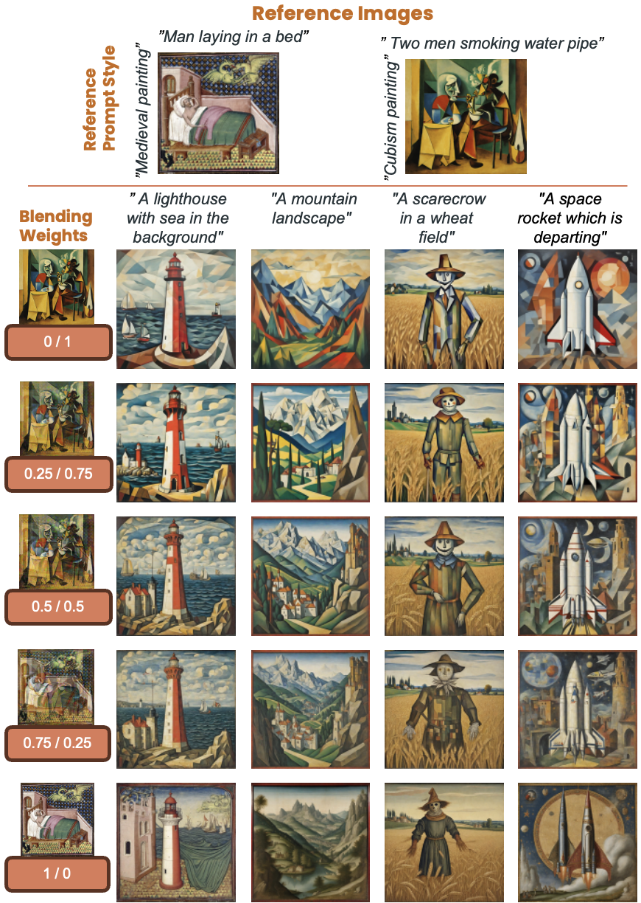
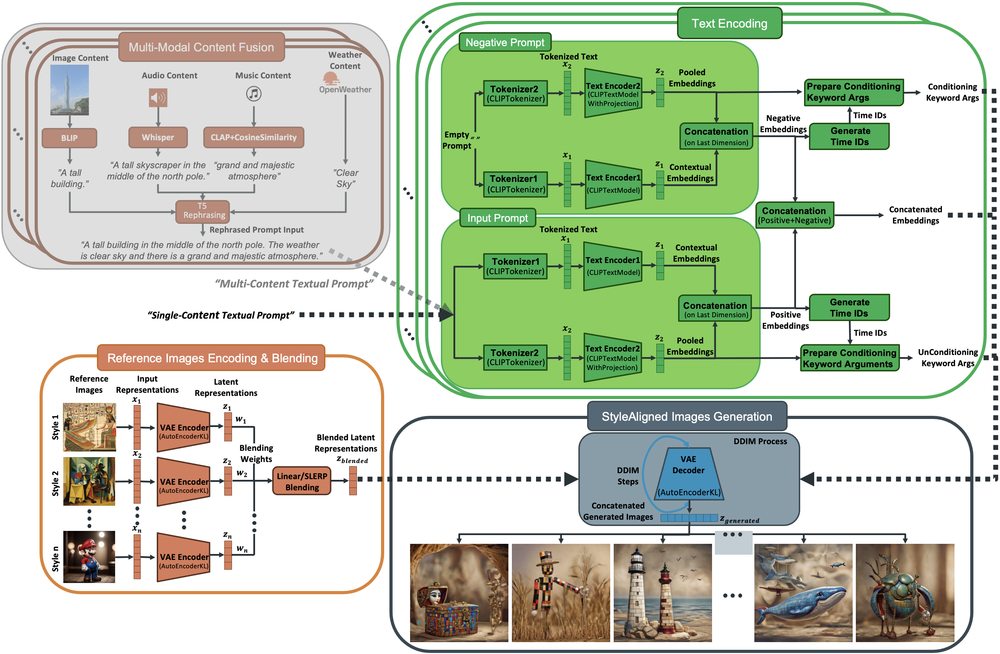
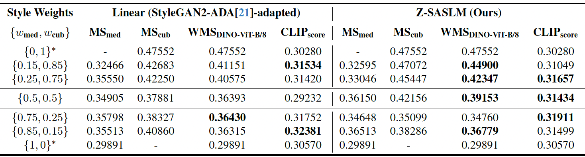
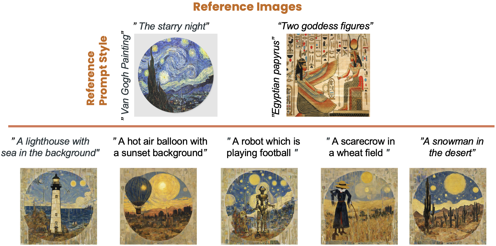
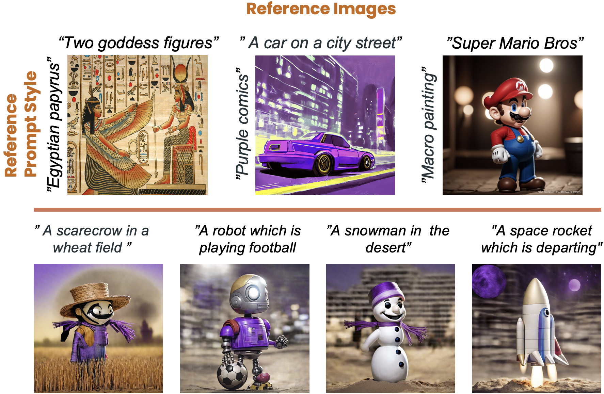
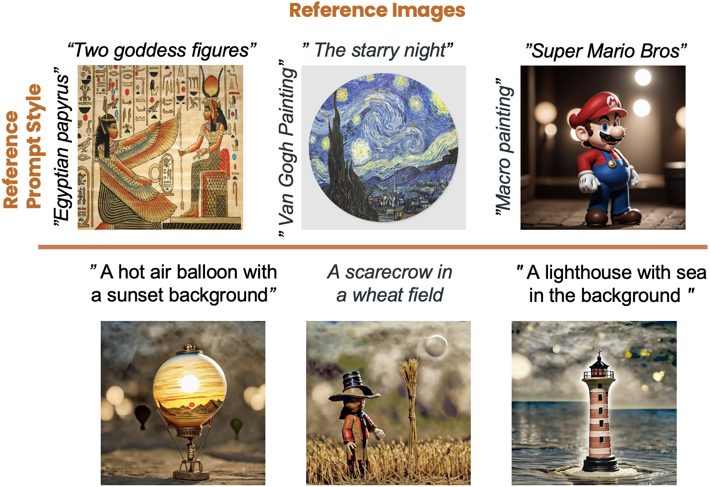
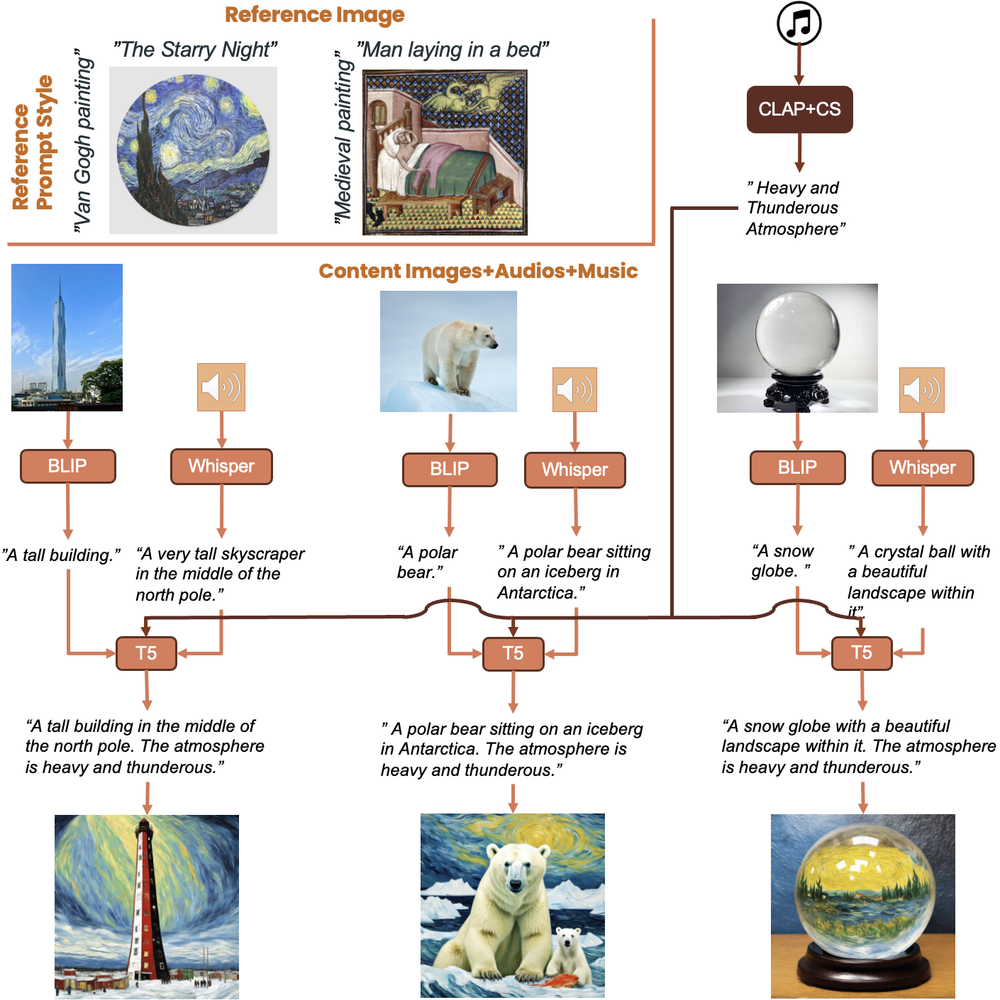

<div align="center">

# <b>Z-SASLM: Zero-Shot Style-Aligned SLI Blending Latent Manipulation

[Alessio Borgi](https://www.linkedin.com/in/alessio-borgi-a85b461a2)<sup>*</sup>, [Luca Maiano](https://scholar.google.com/citations?user=FZyBVqkAAAAJ&hl=it&oi=ao), [Irene Amerini](https://scholar.google.com/citations?user=4ZDhr6UAAAAJ&hl=it&oi=ao)

Sapienza University of Rome
<p>
  <a href="mailto:borgi.1952442@studenti.uniroma1.it">borgi.1952442@studenti.uniroma1.it</a>,
  <a href="mailto:maiano@diag.uniroma1.it">maiano@diag.uniroma1.it</a>,
  <a href="mailto:amerini@diag.uniroma1.it">amerini@diag.uniroma1.it</a>
</p>

<p align="center"><sup>*</sup>Corresponding author</p>

### <b>[CVPR 2025](https://cvpr.thecvf.com/) [Workshop on AI for Creative Visual Content Generation, Editing, and Understanding](https://cveu.github.io/)
### <b>[Published in the Official CVPR 2025 Workshop Procedings](https://cveu.github.io/)

</div>


</div>

<p align="center">
  <a href="https://cveu.github.io/">
    
  </a>
  <a href="https://arxiv.org/abs/2503.23234">
    
  </a>
  <a href="https://alessioborgi.github.io/Z-SASLM.github.io/">
    
  </a>
  <a href="https://huggingface.co/papers/2503.23234">
    
  </a>
  <a href="https://www.researchgate.net/publication/390303255_Z-SASLM_Zero-Shot_Style-Aligned_SLI_Blending_Latent_Manipulation">
    
  </a>
  <a href="https://paperswithcode.com/paper/z-saslm-zero-shot-style-aligned-sli-blending">
    
  </a>
  <a href="https://www.academia.edu/128519694/Z_SASLM_Zero_Shot_Style_Aligned_SLI_Blending_Latent_Manipulation">
    
  </a>
</p>


---

## Overview 🚀

This is an *Official Implementation* of the paper **Z-SASLM: Zero-Shot Style-Aligned SLI Blending Latent Manipulation**, accepted at **CVPR 2025, Workshop on AI for Creative Visual Content Generation, Editing, and Understanding** and published in the **2025 IEEE-CVF Conference on Computer Vision and Pattern Recognition Workshops (CVPRW)**, i.e. the 𝐎𝐟𝐟𝐢𝐜𝐢𝐚𝐥 𝐂𝐕𝐏𝐑 𝐖𝐨𝐫𝐤𝐬𝐡𝐨𝐩 𝐏𝐫𝐨𝐜𝐞𝐝𝐢𝐧𝐠𝐬!🚀 

Z-SASLM is a zero-shot framework for multi-style image synthesis during image generation that leverages Spherical Linear Interpolation (SLI) to achieve smooth, coherent blending—without any fine-tuning. 

<p align="center">
  
</p>


---

## Abstract ✨

> We introduce **Z-SASLM**, a **Zero-Shot Style-Aligned SLI (Spherical Linear Interpolation) Blending Latent Manipulation** pipeline that overcomes the limitations of current multi-style blending methods. Conventional approaches rely on linear blending, assuming a flat latent space leading to suboptimal results when integrating multiple reference styles. In contrast, our framework leverages the non-linear geometry of the latent space by using SLI Blending to combine weighted style representations. By interpolating along the geodesic on the hypersphere, Z-SASLM preserves the intrinsic structure of the latent space, ensuring high-fidelity and coherent blending of diverse styles—all without the need for fine-tuning. We further propose a new metric, Weighted Multi-Style DINO VIT-B/8, designed to quantitatively evaluate the consistency of the blended styles. While our primary focus is on the theoretical and practical advantages of SLI Blending for style manipulation, we also demonstrate its effectiveness in a multi-modal content fusion setting through comprehensive experimental studies. Experimental results show that Z-SASLM achieves enhanced and robust style alignment. 

---

## Features 🔥

- **Zero-Shot Versatility:** Unlock infinite style possibilities without any fine-tuning.
- **SLI Blending for Multi-Reference Style Conditioning:** Introduces a novel architecture that leverages spherical linear interpolation to seamlessly blend multiple reference styles without any fine-tuning.
- **Latent Space Mastery:** Capitalizes on the intrinsic non-linearity of the latent manifold for optimal style integration.
- **Innovative Evaluation Metric:** Proposes the Weighted Multi-Style DINO VIT-B/8 metric to rigorously quantify style consistency across generated images.
- **Multi-Modal Content Fusion:** Demonstrates the framework’s robustness by integrating diverse modalities—such as image, audio, and weather data—into a unified content fusion approach.


---

## Installation 🛠️

Clone the repository and install the necessary dependencies:

```bash
git clone https://github.com/alessioborgi/Z-SASLM.git
cd Z-SASLM
pip install -r requirements.txt
```

---

## Architecture Proposed 📐
<p align="center">
  
</p>
Our framework is built as a modular pipeline that efficiently combines diverse style references and multi-modal cues without fine-tuning. The architecture comprises four main components:

1. **Reference Image Encoding & Blending:**  
   - A Variational Autoencoder (VAE) extracts latent representations from each reference style image.  
   - Our novel Spherical Linear Interpolation (SLI) Blending module then fuses these latent codes along the geodesic of the hypersphere, ensuring smooth and coherent style transitions.

2. **Text Encoding:**  
   - Textual prompts are encoded using a CLIP-based module, capturing semantic cues and aligning them with visual features.  
   - This stage supports both simple captions and richer prompts derived from multiple modalities.

3. **Style-Aligned Image Generation:**  
   - The blended style representation is combined with the text embeddings to condition a diffusion-based generation process.  
   - A style-aligned attention mechanism reinforces consistent style propagation throughout the image generation.

4. **Optional Multi-Modal Content Fusion:**  
   - Additional inputs such as audio, music, or weather data are first transformed into text.  
   - These are fused into a single “Multi-Content Textual Prompt” via a T5-based rephrasing module, further enriching the conditioning signal for improved creative synthesis.


---

## Results & Examples 📊
<p align="center">
  
</p>

Our experimental evaluation confirms the effectiveness of Z-SASLM across various style blending scenarios:

- **Style Consistency:**  
  Quantitative comparisons using our innovative Weighted Multi-Style DINO VIT-B/8 metric demonstrate that our SLI Blending significantly outperforms conventional linear interpolation—producing images with robust and coherent style alignment.

- **Visual Quality:**  
  As shown in the example figures below, Z-SASLM preserves fine stylistic details and avoids the abrupt transitions common in linear blending.  
  <p align="center">
    
  </p>
- **Multi-Modal Fusion:**  
  Our ablation studies reveal that incorporating diverse content (e.g., audio and weather data) further enhances the richness of the generated visuals, confirming the benefits of our multi-modal integration.

Overall, the results validate that Z-SASLM not only improves style consistency but also delivers high-fidelity images even under challenging multi-reference conditions. Explore the [notebooks](./notebooks) for interactive examples and detailed visual comparisons.

<p align="center">
  
  
</p>

---

## Ablations 📜

We conducted extensive ablation studies to assess the impact of key components in our framework. Here, we detail our investigations into Guidance Ablation and Multi-Modality Fusion Ablation.

### Guidance Ablation

In the guidance ablation study, we vary the guidance scale (e.g., from 5 to 30) while keeping the style weights constant (e.g., {0.5, 0.5}). Our findings include:

- **Lower Guidance:** Results in images that adhere closely to the textual prompt but may lack pronounced stylistic features.
- **Higher Guidance:** Amplifies style details, though it can sometimes overpower subtle content cues.
- **Optimal Range:** A moderate guidance range (typically 15–20) achieves a balanced trade-off between style fidelity and prompt adherence.

Detailed quantitative metrics (e.g., Weighted Multi-Style DINO VIT-B/8 scores) and qualitative examples illustrate how the guidance scale influences the overall style consistency and image quality.
<p align="center">
    
  </p>

### Multi-Modality Fusion Ablation

Our multi-modality fusion ablation explores the benefits of incorporating additional modalities beyond simple text (e.g., audio, music, and weather data) into the prompt. Key observations include:

- **Enhanced Context:** Fusing multi-modal data enriches the textual prompt, leading to more contextually informed and creative outputs.
- **Improved Style Consistency:** The integration of diverse modalities boosts the robustness of style alignment across generated images.
- **Comparative Analysis:** Models with multi-modal fusion outperform their single-modal counterparts in terms of both quantitative metrics and perceptual image quality.

Both ablation studies confirm that our design choices—adjusting the guidance scale and integrating multi-modal content—significantly contribute to the robustness and versatility of Z-SASLM.
<p align="center">
    
  </p>

---

## Citation 📚

If you find our work useful, please cite our paper:

```bibtex
@misc{borgi2025zsaslmzeroshotstylealignedsli,
      title={Z-SASLM: Zero-Shot Style-Aligned SLI Blending Latent Manipulation}, 
      author={Alessio Borgi and Luca Maiano and Irene Amerini},
      year={2025},
      eprint={2503.23234},
      archivePrefix={arXiv},
      primaryClass={cs.CV},
      url={https://arxiv.org/abs/2503.23234}, 
}
```

---

## License 📄

This project is licensed under the CC0-1.0 License. See the [LICENSE](LICENSE) file for details.

---
